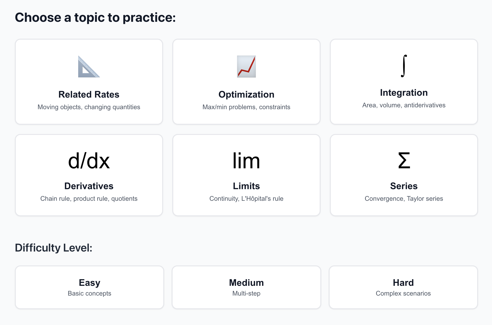
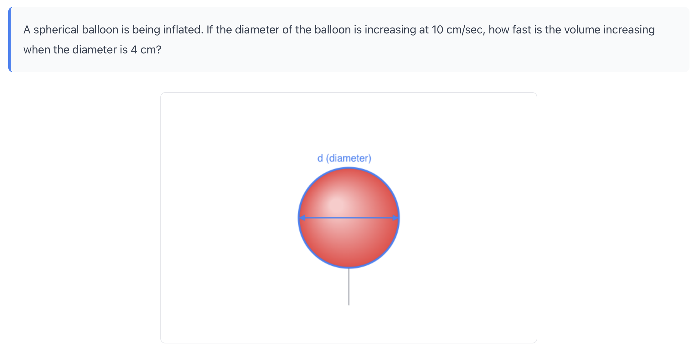
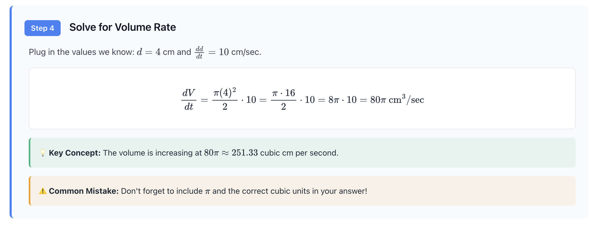

# Math Wiz

A web-based calculus problem solver that provides step-by-step solutions with interactive visualizations. Built with vanilla JavaScript and integrated with AI language models for comprehensive problem-solving capabilities.

## Overview

Math Wiz is an educational tool designed to solve calculus problems through text input or image upload. The application renders mathematical notation using LaTeX and generates visual diagrams to aid understanding. It demonstrates integration with large language model APIs and computer vision for mathematical problem analysis.

## Technologies Used

- HTML5, CSS3, JavaScript (ES6+)
- MathJax 3.0 for mathematical typesetting
- Canvas API for diagram rendering
- Anthropic Claude API (primary)
- OpenAI GPT-4 API (alternative)
- Python SimpleHTTPServer for local development

## Features

- Text-based calculus problem input and solution generation
- Image upload with OCR and problem extraction
- Step-by-step solution breakdowns with explanations
- LaTeX rendering for mathematical expressions
- Interactive canvas-based visualizations
- Support for related rates, optimization, derivatives, integrals, limits, and series

## Screenshots

### Topic Selection Interface

*Select from six calculus topics with varying difficulty levels*

### Problem Display with Interactive Diagram

*Visual representation of calculus problems using Canvas API*

### Step-by-Step Solution with LaTeX

*Detailed solutions with mathematical notation, key concepts, and common mistake warnings*

## Installation

### Prerequisites

- Python 3.x installed on your system
- API key from Anthropic or OpenAI (required for AI-powered features)

### Setup Instructions

1. Clone the repository:
```bash
git clone https://github.com/nwrenn27-sketch/Math-Wiz.git
cd Math-Wiz
```

2. Configure API credentials:

   Edit `config.js` and add your API key:
   ```javascript
   const CONFIG = {
       api: {
           anthropic: {
               apiKey: 'your-api-key-here',
               model: 'claude-3-5-sonnet-20241022',
               enabled: true
           }
       }
   };
   ```

3. Start the local server:
```bash
python3 -m http.server 8000
```

4. Navigate to `http://localhost:8000` in your browser.

## Usage

### Solving Problems via Text Input

1. Enter a calculus problem in the text area
2. Click "Solve" to generate a step-by-step solution
3. Review the rendered solution with LaTeX formatting and diagrams

### Solving Problems via Image Upload

1. Click the upload area or drag and drop an image file
2. Supported formats: PNG, JPG, PDF (maximum 10MB)
3. The application will extract the problem text and generate a solution

### Built-in Examples

The application includes four pre-configured related rates problems that work without AI integration:
- Two cars moving apart
- Plane and radar station distance calculation
- Balloon inflation rate
- Cube volume expansion

## Project Structure

```
Math Wiz/
├── index.html              # Main application interface
├── practice-app.js         # Student practice mode implementation
├── practice-styles.css     # Practice mode styling
├── script.js               # Core application logic
├── styles.css              # Main application styles
├── ai-integration.js       # AI API integration layer
├── config.js               # API configuration file
├── problems.js             # Problem database and definitions
└── README.md               # Project documentation
```

## Technical Details

### Architecture

The application follows a modular architecture with separation of concerns:
- UI rendering and event handling in `script.js`
- AI service abstraction in `ai-integration.js`
- Configuration management in `config.js`
- Mathematical problem definitions in `problems.js`

### API Integration

The application supports multiple AI providers through a unified interface. API calls are made client-side, and no user data is stored on external servers beyond the API provider's processing.

## Known Limitations

- Requires a valid API key for solving arbitrary problems
- Image analysis quality depends on image clarity and formatting
- API usage incurs costs based on provider pricing models
- Solutions are generated by AI and should be verified for accuracy

## Future Enhancements

- Add support for additional mathematical domains beyond calculus
- Implement solution history and bookmarking
- Add user authentication for personalized problem sets
- Develop offline mode with expanded built-in problem library

## License

This project is available for educational and portfolio purposes.

## Contact

Repository: [github.com/nwrenn27-sketch/Math-Wiz](https://github.com/nwrenn27-sketch/Math-Wiz)
